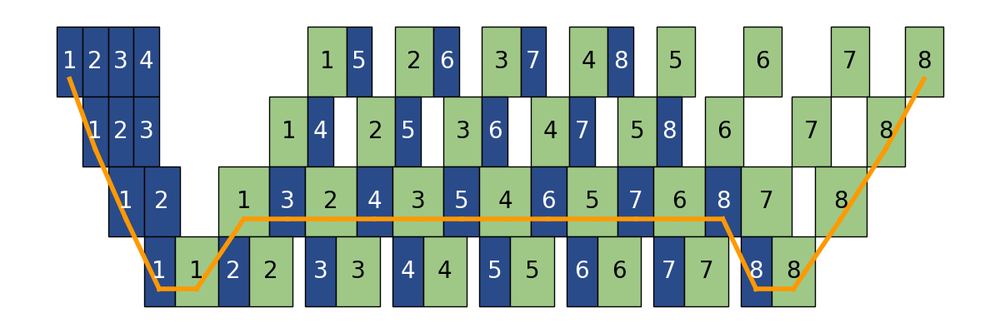

<div align="center"><i><h3>This is not a pipe.</h3></i></div>

# René

René is a visualizer for pipeline parallel training schedules like 1F1B.

[Why the name?](https://en.wikipedia.org/wiki/The_Treachery_of_Images)

## Architecture

```
              instantiate   ┌───────────────┐    visualize
          ┌────────────────►│  Instruction  │◄────────────────┐
          │                 └───────────────┘                 │
          │                     ▲                             │
          │                     │ schedule                    │
          │                     │                             │
┌─────────┴──────────┐     ┌────┴────────────┐     ┌──────────┴───────────┐
│  PipelineSchedule  ├────►│  ReneDAG ├────►│  PipelineVisualizer  │
└────────────────────┘     └─────────────────┘     └──────────────────────┘
```

Specify the pipeline schedule (e.g. Synchronous 1F1B) by defining a subclass of `PipelineSchedule`, which is intended to be very similar to DeepSpeed's `PipeSchedule` class.
A `PipelineSchedule` instance defines the order of `Instruction`s executed on each device, and thus instantiates and yields a stream of `Instruction`s that form a *linear chain* of dependencies in the instruction DAG.
See `rene.schedule.Synchronous1F1B` for an example.

`ReneDAG` accepts the pipeline schedule class and pipeline parameters such as the number of stages and microbatches, the duration of each instruction yielded by `PipelineSchedule`, and an optional list of dependency rules, and generates the full list of `Instruction`s by instantiating and invoking the `PipelineSchedule` class passed in.
Refer to `ReneDAG`'s docstring for details on defining custom dependency rules.
You should call `ReneDAG.schedule` in order to assign actual start and finish times for each instruction in the DAG.
Refer to the method's docstring for details on supported scheduling algorithms.

Finally, `PipelineVisualizer` accepts the scheduled `ReneDAG` instance and optional Matplotlib arguments, and generates the final figure.

Also refer to `examples`.
